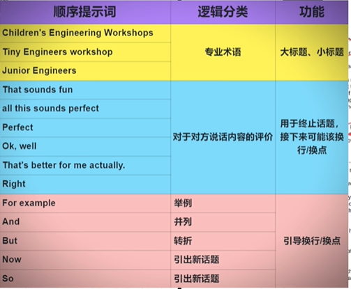
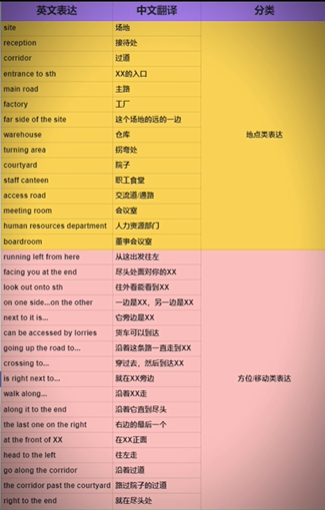

# 雅思听力
## 雅思听力备考全攻略
### 雅思听力总览
时长: 30 min

题量: 4篇40道题目

注意: 只能听一次

听力文本的难度低于阅读：
  - 看着认识，但是听不出来
  - 数字的单词
  - 发音比较特殊的单词
### 所有题型破题方法
#### part one 填空题 
难度最低，争取拿到满分

1. 读题时，注意空格的**词性和单复数**。做预判
2. 空格 + 空格前后 都要看
3. 顺序提示词:

这些顺序提示词需要自己总结。

#### part two 选择题（出现频率更高）
1. 挪车一些时间提前读题
2. 选择题是顺序出题的
3. 读题时，题干重要性>选项。因为题干的一些关键词可以用于在听力时定位
4. 选项都可能听到，但顺序不一定
5. 注意听逻辑连接词
6. 技巧不是很多，更多的是比拼英语硬实力
7. 技巧1：锁定题目 ① 每一段会有一个小的不说话的停顿。②找到和第一题相关的内容
8. 技巧2：注意同一个意思的表达，如set up = found
#### part two 地图题
1. 步骤1：浏览地图本身，包括文字和非文字的信息
2. 步骤2：快速浏览题目
3. 地图题应对策略：积累地图题专用表达
   - 与地点相关的表达
   - 指引方位或者移动方向的表达
  
#### part three 多选题
1. 挪出时间读题
2. 读题时，题干重要性>选项。因为题干的一些关键词可以用于在听力时定位
3. 选项都可能听到，但顺序不一定
4. 逻辑关系词
5. 多选题之间，没有语音停顿。要靠**题干关键字**锁定题目
6. 问 “共识” 的多选题的解题技巧：听到同意上一个人的话，那么说明上一个地方就含有答案。

#### part three 匹配题
1. 步骤1：浏览题目
2. 步骤2：浏览选项
3. 步骤3：听取答案
4. 匹配题技巧/能力：同义改写
5. 题干是比较容易听到的
6. 无关的内容，可以听不懂
7. 逻辑提示词
8. 抓准 “共识类” 表达

#### part four 填空题 
1. 题目是顺序出题的
2. 需要挪出时间提前读题
3. 读题时，预判空格词性
4. 难点1：题目出现了，听力没有的内容
5. 难点2：关键词出现了词性的替换，如从 appeal 到 appealing
6. 题目的 同义改写 难度大
7. 技巧：specifically 是 考点提示词，这样的词还有：surprisingly. remarkable

### 雅思听力硬实力: 全文精听
1. 积累：
   - 认识，但听不出来(<=3遍)
   - 没背过(>3遍)
2. 工具
   - 听力原稿
   - 播放软件
### 备考规划
1. 备考材料：剑桥雅思真题: 15以后
2. 备考时间：
   - 先：阅读 + 听力
   - 再：口语 + 写作

