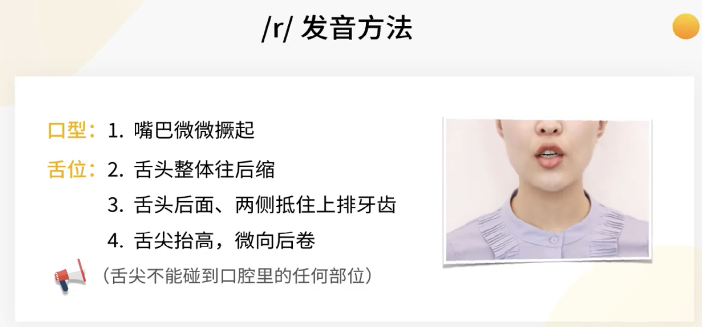
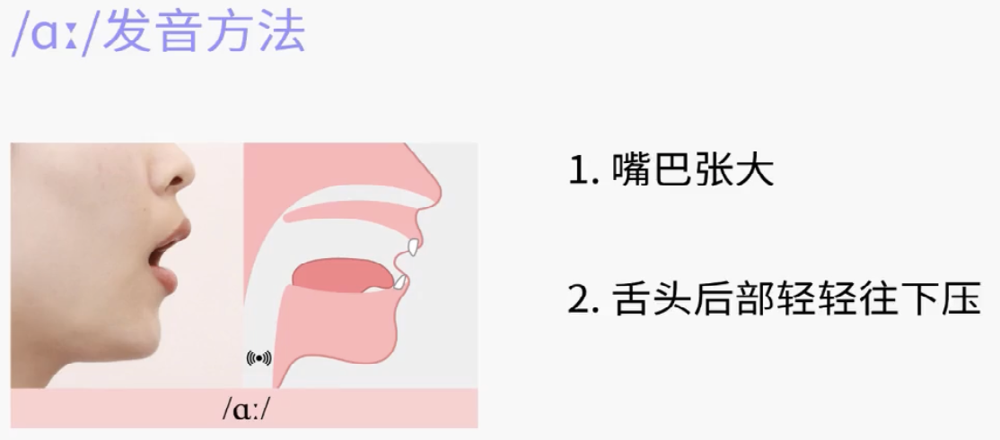
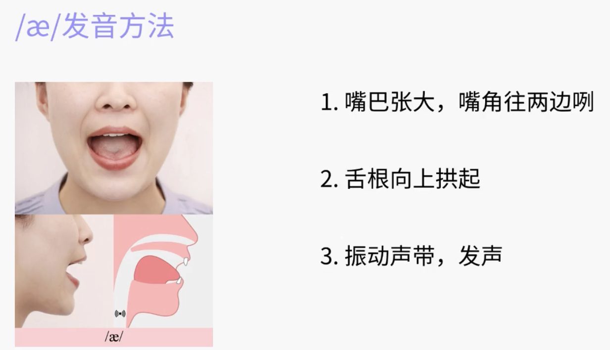

# 专项语法课
## 语法综述
### 语法到底是什么
- 语法是英语的语言法则（规则）。  
- grammar：语法
### 语法为什么重要
- 语法是学习英语的捷径
- 单词 + 语法（组合排序规则） = 句子
### 语法要学些什么
- 词法：准确的用词
    - 单词的变形规则
    - 单词的不同种类：介词、冠词、形容词、名词、代词、感叹词、动词、副词、数词、连词
        > 介 冠 形 名 代
        >
        > 感 动 副 数 连                    
- 句法
### 语法怎样学
- 不要死记硬背
- 语法中有许多特例，不是一层不变的
# 听说
## 美音的特色
### 卷舌音`/r/`
- 英音：常常忽略R的存在 。英式英语制度后面带有元音的R，例如：right和red
  美音：不放过任何一个读R音的机会 
- `/r/`的发音方法

    - 普通话`ri`: 舌尖会接触硬腭
    - 美式`/r/`: 舌尖不接触口腔中任何部位
### flap T 
- 字母T，接近`/d/`
    - 音标：water[ˈwɔːtər]    city[ˈsɪti]    little[ˈlɪt(ə)l]
    - 实际：water[ˈwɔːdər]    city[ˈsɪdi]    little[ˈlɪd(ə)l]
- T在以下情况不读flap T
    - 以T开头的单词：table，time
    - T在重读音节的单词：guitar，protect
- flap T 的发音条件：字母T要夹在两个元音发音之间
### 字母O在单词中的发音：ɑː
- 英式: job[dʒɒb]    clock[klɒk]
- 美式: job[dʒɑːb]   clock[klɑːk]
- ɑː的发音

### 字母A在单词中的发音：æ
- 英式:pass[pɑːs]    ask[ɑːsk]    class[klɑːs]
- 美式:pass[pæs]     ask[æsk]     class[klæs]
- æ的发音

- 当/ɑː/音后面是卷舌音/r/时，不能把它替换为/æ/ 
  car: 英[kɑː(r)]    美[kɑːr] 
  party: 英[ˈpɑːti]  美[ˈpɑːrti] 
  heart: 英[hɑːt]    美[hɑːrt]
