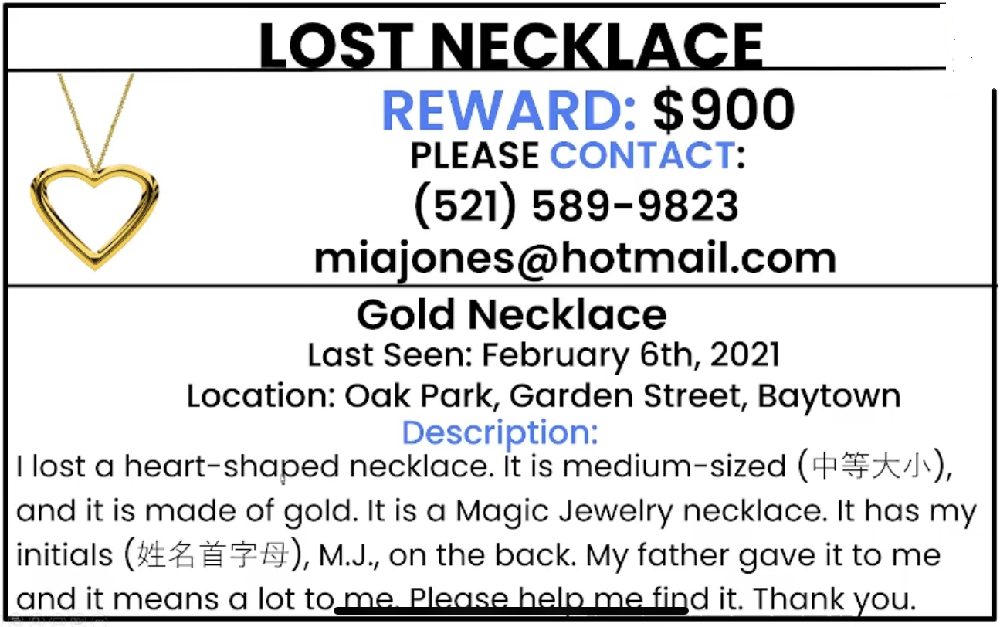
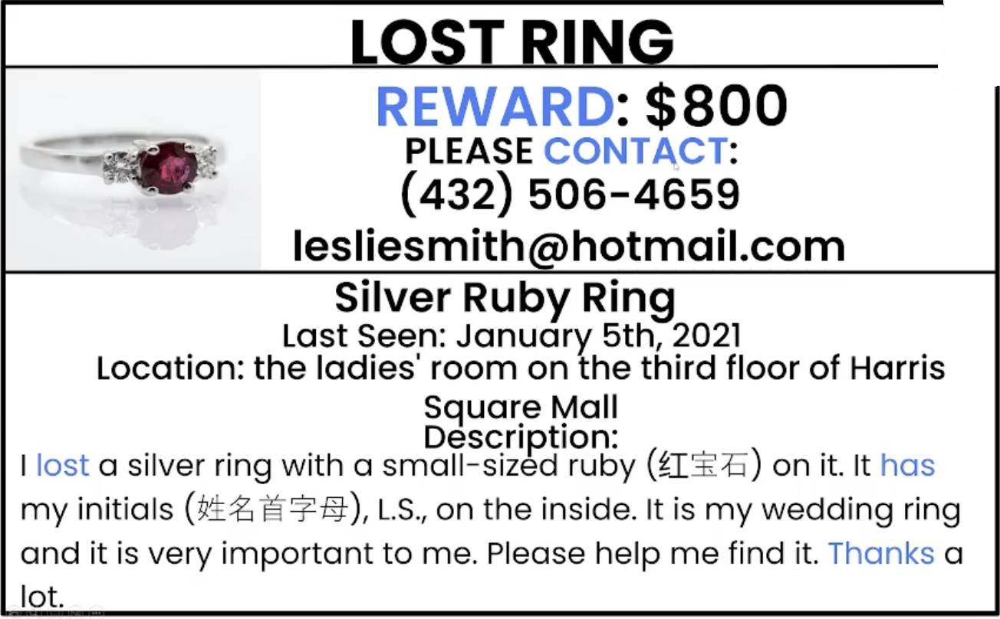

# Writing
## Writing a Flier for something Lost (写询问启事)
 Flier:（美）广告传单 
 leaflet: n.   
 brochure   
 pamphlets   
 ## 范文
 ### 范文一
 
 - heart-shaped : 心形的
 - it means a lot to me : 对我很重要
 - It has my initials(姓名首字母), M.j. 
 - medium-sized :中等大小
 ### 范文二
  
  - ladies' room : 女士洗手间    men's room : 男士洗手间
 ## 核心知识点学习: 写寻物启事的要点
 - Contact and Reward: 联系方式与酬金
 - Describing the lost Thing: 失物描述
    - What is the lost thing?
    - shape:
        - round: The button(纽扣) is round(圆形).
        - square: There is a square(方形) button on the table.
        - rectangular: 长方形
        - triangular: 三角形
        - star-shaped: 五边心形
        - oval shape: 椭圆形
    - size
        - small
        - large
        - medium-sized
    - color
    - material: 材质
        - This ring **is made of** silver.  
         = This ring is silver. 
         = This is a silver ring.
    - weight: 重量
        - This bag is **light/heavy**(轻/重).
        - This bag **weight around**(大约有多重) ten pounds.
    - brand: 品牌  ... is a brand name + object
        - It is a <u>Magic Jewelry(a brand name)</u> necklace.
    - What is special about the lost thing? 失物的特点
        - The dress **has** lots of white dots(小圆点) **on** it. 
        ... has ... on ...:  在 ... 上有 ...
        - **There are** lots of whites dots **on** that dress. 
        there is/are ... on ...
 - Expressing Gratitude: 表达感谢
 